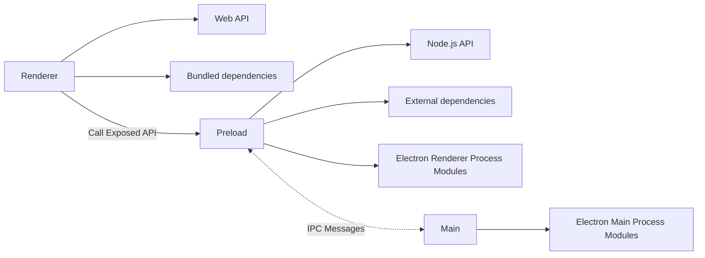

# Vite Electron React Builder

[](https://nodejs.org/about/releases/)
[](https://github.com/npm/cli/releases)


## Get started

Follow these steps to get started with this template:

1. Click the **[Use this template](https://github.com/ZacharyWin/vite-electron-react/generate)** button (you must be logged in) or just clone this repo.
2. If you want to use another package manager don't forget to edit [`.github/workflows`](/.github/workflows) -- it uses `pnpm` by default.

That's all you need. 😉


## Features

### Electron [][electron]
- This template uses the latest electron version with all the latest security patches.
- The architecture of the application is built according to the security [guides](https://www.electronjs.org/docs/tutorial/security) and best practices.
- The latest version of the [electron-builder] is used to compile the application.


### Vite [][vite]
- [Vite] is used to bundle all source codes. This is an extremely fast packer that has a bunch of great features. You can learn more about how it is arranged in [this](https://youtu.be/xXrhg26VCSc) video.
- Vite [supports](https://vitejs.dev/guide/env-and-mode.html) reading `.env` files. You can also specify types of your environment variables in [`types/env.d.ts`](types/env.d.ts).
- Hot reloads for `Main` and `Renderer` processes.

Vite provides many useful features, such as: `TypeScript`, `TSX/JSX`, `CSS/JSON Importing`, `CSS Modules`, `Web Assembly` and much more.

[See all Vite features](https://vitejs.dev/guide/features.html).


### Continuous Integration
- The configured workflow will check the types for each push and PR.
- The configured workflow will check the code style for each push and PR.
- **Automatic tests** used [Vitest ][vitest] -- A blazing fast test framework powered by Vite.
  - Unit tests are placed within each package and run separately.
  - End-to-end tests are placed in the root [`tests`](tests) directory and use [playwright].


### Continuous delivery
- Each time you push changes to the `main` branch, the [`release`](.github/workflows/release.yml) workflow starts, which creates a release draft.
  - The version is automatically set based on the current date in the format `yy.mm.dd-minutes`.
  - Notes are automatically generated and added to the release draft.
  - Code signing supported. See [`compile` job in the `release` workflow](.github/workflows/release.yml).
- **Auto-update is supported**. After the release is published, all client applications will download the new version and install updates silently.

## How it works
The template requires a minimum amount [dependencies](package.json). Only **Vite** is used for building, nothing more.

### Project Structure

The structure of this template is very similar to the structure of a monorepo.

The entire source code of the program is divided into three modules (packages) that are each bundled independently:
- [`packages/main`](packages/main)
  Electron [**main script**](https://www.electronjs.org/docs/tutorial/quick-start#create-the-main-script-file).
- [`packages/preload`](packages/preload)
  Used in `BrowserWindow.webPreferences.preload`. See [Checklist: Security Recommendations](https://www.electronjs.org/docs/tutorial/security#2-do-not-enable-nodejs-integration-for-remote-content).
- [`packages/renderer`](packages/renderer)
  Electron [**web page**](https://www.electronjs.org/docs/tutorial/quick-start#create-a-web-page).

### Build web resources

The `main` and `preload` packages are built in [library mode](https://vitejs.dev/guide/build.html#library-mode) as it is simple javascript.
The `renderer` package builds as a regular web app.


### Compile App
The next step is to package and compile a ready to distribute Electron app for macOS, Windows and Linux with "auto update" support out of the box.

To do this using the [electron-builder]:
- Using the npm script `compile`: This script is configured to compile the application as quickly as possible. It is not ready for distribution, it is compiled only for the current platform and is used for debugging.
- Using GitHub Actions: The application is compiled for any platform and ready-to-distribute files are automatically added as a draft to the GitHub releases page.


### Using external modules in renderer
According to [Electron's security guidelines](https://www.electronjs.org/docs/tutorial/security#2-do-not-enable-nodejs-integration-for-remote-content), Node.js integration is disabled for remote content. This means that **you cannot call any Node.js api in the `packages/renderer` directly**. This also means you can't import external modules during runtime in the renderer:
```js
// renderer.bundle.js
const {writeFile} = require('fs') // ReferenceError: require is not defined
writeFile()
```

To use external modules in Renderer you **must** describe the interface in the `packages/preload` where the Node.js api is allowed:
```ts
// packages/preload/src/index.ts
import {type BinaryLike, createHash} from 'crypto';
import {exposeInMainWorld} from './exposeInMainWorld';

exposeInMainWorld('nodeCrypto', {
  sha256sum(data: BinaryLike) {
    const hash = createHash('sha256');
    hash.update(data);
    return hash.digest('hex');
  },
});
```
If you use a TypeScript you must add the signature of your method to the contracts:
```ts
// packages/preload/contracts.d.ts 
interface Exposed {
    nodeCrypto: { 
        sha256sum(data: import("crypto").BinaryLike): string; 
    };
}
```
And now, you can safely use the registered method:
```ts
// packages/renderer/src/App.vue
window.nodeCrypto.sha256sum('data')
```

As a result, the architecture of interaction between all modules is as follows:



[Read more about Security Considerations](https://www.electronjs.org/docs/tutorial/context-isolation#security-considerations).


### Modes and Environment Variables
All environment variables set as part of the `import.meta`, so you can access them as follows: `import.meta.env`.

If you are using TypeScript and want to get code completion you must add all the environment variables to the [`ImportMetaEnv` in `types/env.d.ts`](types/env.d.ts).

The mode option is used to specify the value of `import.meta.env.MODE` and the corresponding environment variables files that need to be loaded.

By default, there are two modes:
- `production` is used by default
- `development` is used by `npm run watch` script

When running the build script, the environment variables are loaded from the following files in your project root:

```
.env                # loaded in all cases
.env.local          # loaded in all cases, ignored by git
.env.[mode]         # only loaded in specified env mode
.env.[mode].local   # only loaded in specified env mode, ignored by git
```

To prevent accidentally leaking env variables to the client, only variables prefixed with `VITE_` are exposed to your Vite-processed code. e.g. the following file:

```
DB_PASSWORD=foobar
VITE_SOME_KEY=123
```
Only `VITE_SOME_KEY` will be exposed as `import.meta.env.VITE_SOME_KEY` to your client source code, but `DB_PASSWORD` will not.


